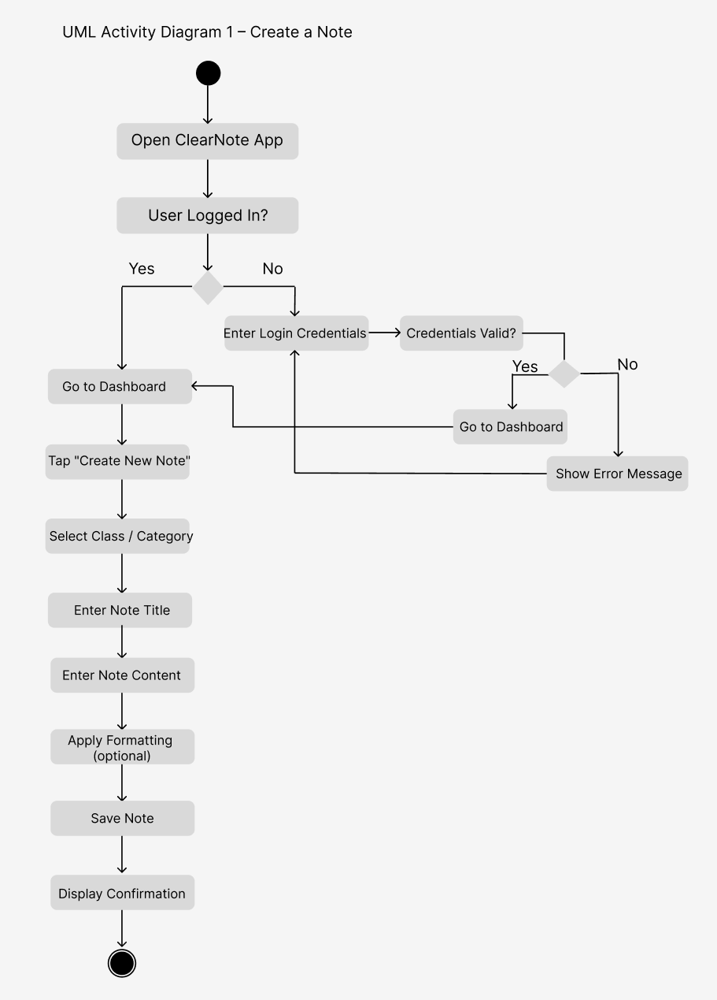
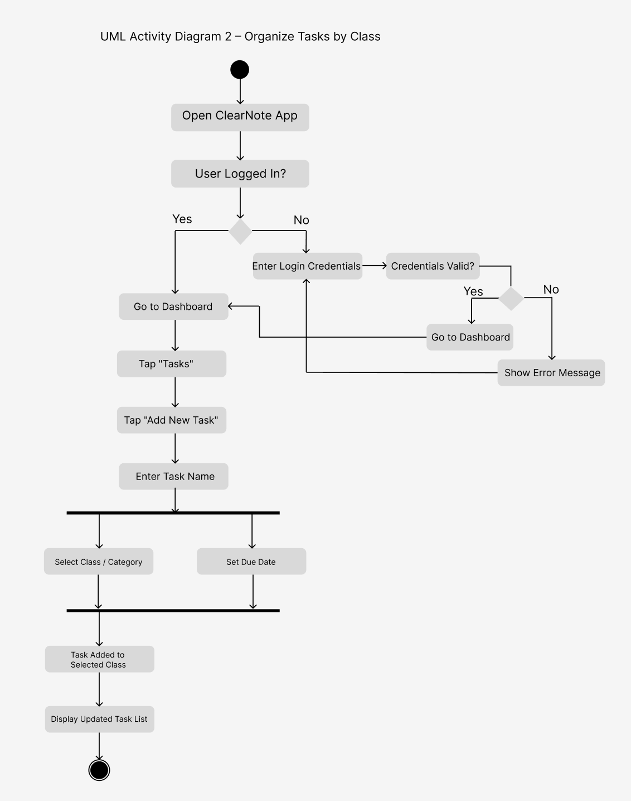

# Specification Phase Exercise

A little exercise to get started with the specification phase of the software development lifecycle. See the [instructions](instructions.md) for more detail.

## Team Members

- **Abir Mahmood**  
  GitHub: https://github.com/abirmahmood6  

- **Harrison Wong**  
  GitHub: https://github.com/harrisonmangitwong  

- **Robin C.**  
  GitHub: https://github.com/localhost433  

- **Ami**  
  GitHub: https://github.com/asb9823

- **Owen Zhang**  
  GitHub: https://github.com/owenzhang2004  

## Brief App Overview

ClearNote is an app designed for college students to have quick, convenient, yet robust notetaking
capabilities. Our goal is to prioritize loading times and performance so students can quickly
jot down quick notes and ideas to reference later, while also implementing formatting and categorization
functionality so they can stay organized.

## Stakeholders

Name: Edwin Chao (college senior, majors in CS)

Goals/Needs:

- Reliably keep track of all tasks / to-do items
- Stay organized by class / category, without getting mixed up
- Take notes quickly and conveniently
- Have robust formatting functions notes are neat and easy to comprehend

Problem/Frustrations:

- Current notetaking apps like Notion can feel too overwhelming
- Apps with more robust functionality take too long to load sometimes
- Difficulty sifting through old notes retrospectively
- Difficulty comprehending notes that were taken quickly retrospectively

## Product Vision Statement

To enable productivity through simplicity and convenience.

## User Requirements

1. As a college student, I want to quickly create a note so that I can capture information during lectures without slowing down.

2. As a college student, I want to organize tasks by class so that I don’t miss deadlines or mix up assignments.

3. As a student, I want to apply formatting like headings and bullet points so that my notes are easy to read and understand later.

4. As a student, I want to see all my notes grouped by class so that I can find information quickly when studying.

5. As a student, I want to add a task with a due date so that I can keep track of upcoming assignments.

6. As a student, I want to edit my notes after creating them so that I can fix mistakes or add additional information.

7. As a student, I want to search through my notes so that I can quickly find older information when reviewing.

8. As a student, I want to view only the tasks for a specific class so that I can focus on one course at a time.

9. As a student, I want the app to load quickly so that I can take notes and check tasks without delays.

10. As a student, I want a simple and uncluttered interface so that I don’t feel overwhelmed while managing my notes and tasks.

11. As a student, I want to be able to access my notes and tasks across multiple devices so that I can study and stay organized on the go.

12. As a student, I want to view my tasks organized by group so that I can easily see what I have to do for each category.

## Activity Diagrams

### UML Diagram 1 – Create a Note

**User Story:**  
As a college student, I want to quickly create a note so that I can capture information during lectures without slowing down.

---

### UML Diagram 2 – Organize Tasks by Class

**User Story:**  
As a college student, I want to organize tasks by class so that I don’t miss deadlines or mix up assignments.

## Clickable Prototype

[ClearNote – Figma Prototype](https://www.figma.com/proto/eXSlK0Wa3E6D87HQxDhgb0/mango-wireframes---Prototype?page-id=0%3A1&node-id=65-76&viewport=261%2C529%2C0.24&t=uWXRxeXcwVAgHwc5-1&scaling=scale-down&content-scaling=fixed&starting-point-node-id=32%3A5)
